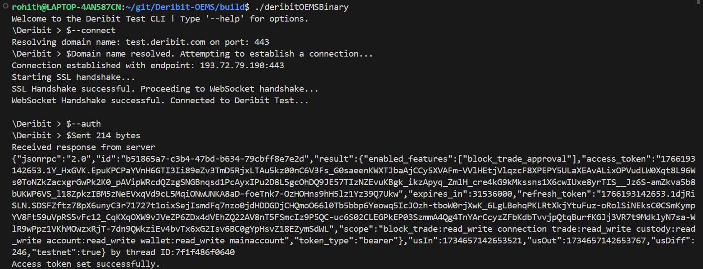

# Order Execution and Management System for Deribit Test API

## Overview

This project is a high-performance Command-Line Interface (CLI) application that facilitates order execution and management on the Deribit Test WebSocket API. Designed for efficient trading, the system employs modern C++ standards and powerful libraries to ensure robustness, scalability, and ease of use.

## Features

-Interactive CLI: User-friendly interface with prompts and clear feedback.

-WebSocket Connectivity: Real-time communication with the Deribit Test WebSocket API.

-Order Management: Place, cancel, and query orders.

-Subscription Management: Subscribe and unsubscribe from market data feeds.

-Multi-threaded I/O: Efficient handling of I/O operations using Boost Asio.

-Signal Handling: Graceful termination on receiving system signals.

-Configuration: Flexible command-line options for customization.

## Project Structure

```sh
.
|-- Header_Files
|   |-- common.h           # Shared utilities and type definitions.
|   |-- json_rpc.h         # JSON-RPC request/response utilities.
|   |-- websocket.h        # WebSocket session management interface.
|   |-- ws_net.h           # Network abstractions for WebSocket communication.
|
|-- src
|   |-- main.cpp           # Entry point of the application.
|   |-- utils.h            # Helper functions and utility declarations.
|   |-- utils.cpp          # Helper functions implementation.
|
|-- CMakeLists.txt         # Build configuration.
|-- README.md              # Project documentation (this file).

```

## Getting Started

To explore the available options, type:

```bash
\Deribit > $--help
```

## Available Commands

### General Commands
- **`--help`**  
  Produce help message.

- **`--connect`**  
  Connect to the Deribit WebSocket API and authenticate.

### Order Management
- **`--place`**  
  Place a new order. Required parameters:
  - **`--direction <buy|sell>`** *(Required)*
  - **`--instrument_name <string>`** *(Required)*
  - **`--type <limit|stop_limit|market|stop_market>`** *(Optional)* Default: `limit`.
  - **`--amount <positive double>`** *(At least one required)*
  - **`--contracts <positive double>`** *(At least one required)*. If both `--amount` and `--contracts` are provided, their values must match.
  - **`--price <positive double>`** *(Required for `limit` and `stop_limit`)*.
  - **`--trigger_price <positive double>`** *(Required for `stop_limit` and `stop_market`)*. Tick size: 0.1.
  - **`--trigger <index_price|mark_price|last_price>`** *(Required for `stop_limit`)*.
  - **`--label <string>`** *(Optional)* Max length: 64 characters.

  Additional options:
  - **`--post_only <bool>`**
  - **`--reject_post_only <bool>`**
  - **`--mmp <bool>`**
  - **`--valid_until <int>`**
  - **`--trigger_offset <positive double>`**

- **`--cancel`**  
  Cancel an order. Required parameters:
  - **`--order_id <string>`**

### Market Data Commands
- **`--get_order_book`**  
  Get the order book for an instrument. Required parameters:
  - **`--instrument_name <string>`**
  - **`--depth <1|5|10|20|50|100|1000|10000>`**

- **`--subscribe`**  
  Subscribe to an instrument. Required parameters:
  - **`--instrument_name <string>`**
  - **`--channel <string>`**

- **`--unsubscribe_all`**  
  Unsubscribe from all the instruments currently subscribed.

- **`--show_subscribed`**  
  Display real-time data for subscribed symbols.

- **`--stop_subscribed`**  
  Stop displaying real-time data for subscribed symbols.

### Program Control
- **`--exit`**  
  Exit the program.

---




!!!WORK IN PROGRESS!!!